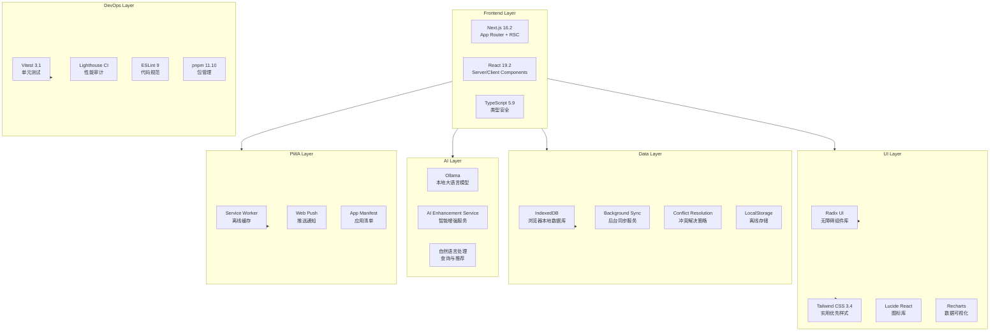
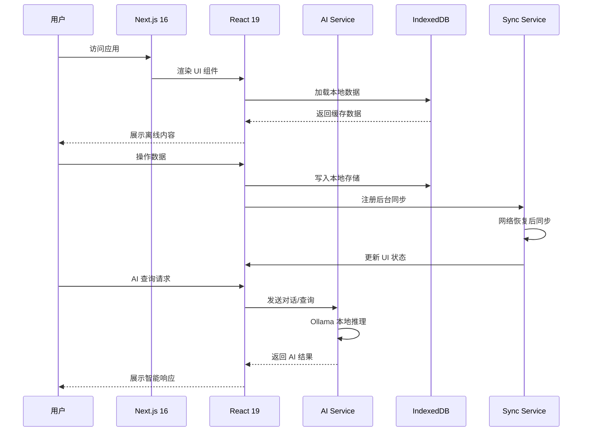

<p align="center">
  
</p>

<div align="center">

# 言语云企业管理系统

### YYC3 Service Platform — 智能 · 融合 · 高效

[](https://nextjs.org/)
[](https://react.dev/)
[](https://www.typescriptlang.org/)
[](https://tailwindcss.com/)
[](https://www.radix-ui.com/)
[](https://vitest.dev/)
[](https://pnpm.io/)

[](https://github.com/YYC-Cube/YYC3-Service-Platform)
[](LICENSE)
[](https://github.com/YYC-Cube/YYC3-Service-Platform)
[](https://nextjs.org/)
[](https://github.com/YYC-Cube/YYC3-Service-Platform)

**智能化、一体化的现代企业管理平台 · AI驱动的全链路企业数字化解决方案**

[核心特性](#核心特性) • [快速开始](#快速开始) • [技术架构](#技术架构) • [功能模块](#功能模块) • [文档](#文档) • [贡献指南](#贡献指南)

</div>

---

## 📋 目录

- [项目简介](#项目简介)
- [核心特性](#核心特性)
- [技术架构](#技术架构)
- [快速开始](#快速开始)
- [功能模块](#功能模块)
- [项目结构](#项目结构)
- [开发命令](#开发命令)
- [贡献指南](#贡献指南)
- [许可证](#许可证)

---

## 🎯 项目简介

**言语云企业管理系统 (YYC3 Service Platform)** 是一个功能全面、技术先进的现代化企业管理平台，采用 **五维驱动（Five Dimensional Driven）** 设计理念，融合 AI 智能、数据分析、任务协同等核心能力，为企业提供全链路的数字化转型解决方案。

### 设计理念

| 维度 | 描述 | 实践 |
|------|------|------|
| **时间维度** | 全生命周期管理 | 实时数据追踪、历史回溯、趋势预测 |
| **空间维度** | 多端无缝适配 | 桌面端、移动端、离线 PWA 全覆盖 |
| **属性维度** | 多维度数据刻画 | 客户标签、任务分类、KPI 指标体系 |
| **事件维度** | 事件驱动架构 | 实时通知、审批流、自动化触发 |
| **关联维度** | 全链路关联分析 | 客户-任务-财务-OKR 闭环 |

### 核心优势

| 优势 | 说明 |
|------|------|
| 🤖 **AI 驱动** | 集成 Ollama 本地大模型，智能推荐与预测分析 |
| 📱 **多端适配** | 响应式设计 + PWA 离线支持，移动办公无忧 |
| 🔄 **离线优先** | IndexedDB 本地存储 + 后台同步，离线可用 |
| 📊 **数据可视化** | Recharts 动态图表，多维度分析看板 |
| ⚡ **高性能** | Next.js 16 流式渲染 + 自动优化 |
| 🎨 **现代 UI** | Radix UI + Tailwind CSS，精美且无障碍 |

---

## ✨ 核心特性

### 🤖 AI 智能引擎
| 功能 | 描述 |
|------|------|
| **AI 智能助手** | 对话式交互，自然语言查询业务数据 |
| **智能推荐** | 基于数据分析的个性化业务建议 |
| **预测分析** | 销售预测、客户增长趋势、需求预测 |
| **异常检测** | 自动识别业务数据异常并预警 |
| **自动化规则** | 智能自动化业务流程与审批 |

### 📊 核心业务模块
| 模块 | 功能 |
|------|------|
| **仪表盘** | 实时业务概览、KPI 指标、快速操作入口 |
| **任务管理** | 完整生命周期管理、优先级、依赖关系 |
| **客户管理** | CRM 全流程、生命周期、满意度分析 |
| **财务管理** | 收支、发票、报表、税务计算 |
| **OKR 管理** | 目标与关键结果对齐与追踪 |
| **审批流程** | 灵活可配置的审批工作流 |
| **KPI 管理** | 绩效指标跟踪与多维度评估 |
| **数据分析** | 销售、客户、产品、地区多维分析 |

### 🔧 技术特性
| 特性 | 描述 |
|------|------|
| **PWA 支持** | 可安装为桌面/移动应用 |
| **离线功能** | 本地数据存储 + 后台同步 |
| **实时通知** | Web Push 推送通知 |
| **性能监控** | Lighthouse CI 自动化性能审计 |
| **移动优化** | 触摸手势、移动专属 UI |
| **主题定制** | 亮色/暗色主题切换 |

---

## 🛠 技术架构

### 技术栈全景



### 核心架构流程



### 组件架构

```mermaid
graph LR
    subgraph 页面层[Pages]
        DASH[Dashboard]
        TASK[Task Manager]
        CRM[Customer CRM]
        FIN[Finance]
        OKR[OKR]
        APPR[Approval]
        ANALytics[Analytics]
    end

    subgraph 业务组件层[Business Components]
        AI_WIDGET[AI Assistant]
        TASK_COMP[Task Components]
        CRM_COMP[CRM Components]
        FIN_COMP[Finance Components]
        CHART[Chart Components]
    end

    subgraph 基础组件层[Base Components]
        UI[shadcn/ui<br/>Radix Primitives]
        LAYOUT[Layout System<br/>Responsive]
        FORM[Form System]
        TABLE[Data Table]
    end

    subgraph 基础设施层[Infrastructure]
        STORE[State<br/>Management]
        AUTH[Auth &<br/>Permissions]
        CACHE[Cache &<br/>Offline]
        MONITOR[Performance<br/>Monitor]
    end

    页面层 --> 业务组件层
    业务组件层 --> 基础组件层
    基础组件层 --> 基础设施层
```



---

## 🚀 快速开始

### 环境要求

| 工具 | 最低版本 | 推荐版本 |
|------|----------|----------|
| Node.js | 18.0+ | 22.x LTS |
| pnpm | 8.0+ | 11.10+ |
| Git | 2.0+ | latest |

### 安装步骤

1. **克隆项目**
   ```bash
   git clone https://github.com/YYC-Cube/YYC3-Service-Platform.git
   cd YYC3-Service-Platform
   ```

2. **安装依赖**
   ```bash
   pnpm install
   ```

3. **配置环境变量**
   ```bash
   cp .env.example .env.local
   ```
   编辑 `.env.local` 文件配置相应环境变量。

4. **启动开发服务器**
   ```bash
   pnpm dev
   ```
   访问 [http://localhost:3000](http://localhost:3000)

### AI 功能配置

```bash
# 安装 Ollama（macOS/Linux）
curl -fsSL https://ollama.ai/install.sh | sh

# 下载推荐模型
ollama pull qwen2.5:7b

# 启动 Ollama 服务
ollama serve
```

配置环境变量：
```env
NEXT_PUBLIC_OLLAMA_URL=http://localhost:11434
NEXT_PUBLIC_OLLAMA_MODEL=qwen2.5:7b
OLLAMA_TIMEOUT=30000
OLLAMA_TEMPERATURE=0.7
OLLAMA_TOP_P=0.9
OLLAMA_MAX_TOKENS=2048
```

---

## 📁 项目结构

```
enterprise-management-system/
├── app/                          # Next.js 16 App Router
│   ├── page.tsx                  # 主页面
│   ├── layout.tsx                # 根布局（含 PWA 元数据）
│   ├── globals.css               # 全局样式（Tailwind + CSS 变量）
│   ├── loading.tsx               # 全局加载状态
│   ├── client-layout.tsx         # 客户端布局包装
│   ├── analysis/                 # 数据分析页面
│   ├── audit/                    # 系统审计页面
│   ├── database/                 # 数据库管理页面
│   ├── docs/                     # 文档页面
│   │   ├── api/                  # API 文档
│   │   └── data-stack/          # 数据栈文档
│   ├── offline/                  # 离线模式页面
│   ├── settings/                 # 设置页面
│   │   ├── layout/
│   │   └── sidebar/
│   └── test/                     # 系统测试页面
├── components/                   # React 19 组件
│   ├── ui/                       # shadcn/ui 基础组件
│   │   ├── button.tsx
│   │   ├── card.tsx
│   │   ├── dialog.tsx
│   │   └── ... (50+ 组件)
│   ├── layout/                   # 布局组件
│   │   ├── responsive-layout.tsx
│   │   ├── responsive-grid.tsx
│   │   └── responsive-container.tsx
│   ├── mobile/                   # 移动端优化组件
│   │   ├── mobile-dashboard.tsx
│   │   ├── mobile-layout.tsx
│   │   └── mobile-notification-center.tsx
│   ├── charts/                   # 图表组件
│   │   ├── sales-chart.tsx
│   │   ├── finance-chart.tsx
│   │   └── performance-chart.tsx
│   ├── performance/              # 性能组件
│   │   └── virtual-scroll.tsx
│   ├── security/                 # 安全组件
│   │   └── permission-guard.tsx
│   ├── dashboard-content.tsx     # 仪表盘
│   ├── task-management.tsx       # 任务管理
│   ├── customer-management.tsx   # 客户管理
│   ├── ai-assistant-widget.tsx   # AI 助手
│   └── ... (60+ 业务组件)
├── lib/                          # 工具库
│   ├── security/                 # 安全模块
│   │   └── permission-system.ts
│   ├── ai-enhancement-service.ts # AI 增强服务
│   ├── ollama-service.ts         # Ollama 集成
│   ├── local-database.ts         # IndexedDB 封装
│   ├── background-sync.ts        # 后台同步
│   ├── sync-service-manager.ts   # 同步管理
│   ├── conflict-resolution.ts    # 冲突解决
│   ├── offline-storage.ts        # 离线存储
│   ├── mobile-detection.ts       # 移动端检测
│   ├── performance-monitor.ts    # 性能监控
│   └── utils.ts                  # 通用工具函数
├── hooks/                        # React Hooks
│   ├── use-mobile.tsx
│   ├── use-toast.ts
│   └── use-offline-operation.ts
├── docs/                         # 项目文档
│   ├── AI_SYSTEM_GUIDE.md        # AI 系统指南
│   ├── SYSTEM_ARCHITECTURE.md    # 系统架构文档
│   ├── api-documentation.tsx     # API 文档
│   └── data-stack-documentation.tsx
├── styles/                       # 样式文件
│   └── globals.css
├── workers/                      # Web Workers
│   └── data-processor.worker.ts
├── test/                         # 测试配置
│   └── setup.ts
├── public/                       # 静态资源
│   ├── Family-001.png            # 项目主视觉
│   ├── icon.svg                  # 应用图标
│   └── yyc3-icons/               # 多平台图标合集
├── next.config.mjs               # Next.js 16 配置
├── tailwind.config.ts            # Tailwind CSS 配置
├── components.json               # shadcn/ui 配置
├── vitest.config.ts              # Vitest 3 配置
├── tsconfig.json                 # TypeScript 配置
└── package.json                  # 项目配置
```

---

## 💻 开发命令

| 命令 | 说明 |
|------|------|
| `pnpm dev` | 启动开发服务器 |
| `pnpm build` | 构建生产版本 |
| `pnpm start` | 启动生产服务器 |
| `pnpm lint` | 代码规范检查（ESLint 9） |
| `pnpm test` | 运行测试（Vitest 3） |
| `pnpm test:watch` | 监听模式运行测试 |
| `pnpm test:coverage` | 测试覆盖率报告 |
| `pnpm type-check` | TypeScript 类型检查 |

### 代码规范

- **框架**: Next.js 16 (App Router) + React 19 (Server/Client Components)
- **语言**: TypeScript 5.9 严格模式
- **样式**: Tailwind CSS 3.4 + CSS 变量
- **组件**: Radix UI + shadcn/ui 组合模式
- **测试**: Vitest 3 + Testing Library
- **包管理**: pnpm 11.10

---

## 🤝 贡献指南

欢迎贡献代码！请遵循以下流程：

1. **Fork** 本仓库
2. **创建特性分支**: `git checkout -b feature/AmazingFeature`
3. **提交更改**: `git commit -m 'feat: add AmazingFeature'`
4. **推送到分支**: `git push origin feature/AmazingFeature`
5. **开启 Pull Request**

### 分支规范

| 分支 | 用途 |
|------|------|
| `main` | 生产环境分支 |
| `develop` | 开发环境分支 |
| `feature/*` | 功能开发分支 |
| `bugfix/*` | 问题修复分支 |
| `hotfix/*` | 紧急修复分支 |

### 提交规范

采用 Conventional Commits 规范：
```
feat: 新功能
fix: 修复 bug
docs: 文档更新
style: 代码格式
refactor: 重构
test: 测试相关
chore: 构建/工具
```

---

## 📄 许可证

本项目采用 **MIT 许可证** — 详见 [LICENSE](LICENSE) 文件。

---

<div align="center">

**👥 核心团队**

[](https://github.com/YYC-Cube)

技术支持: [admin@0379.email](mailto:admin@0379.email)

---

**⭐ 如果这个项目对您有帮助，请给我们一个 Star！**

**[⬆ 回到顶部](#言语云企业管理系统)**

Made with ❤️ by YanYu Cloud Team

</div>
