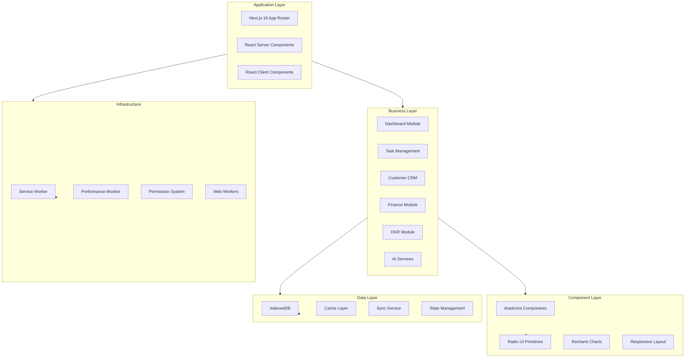
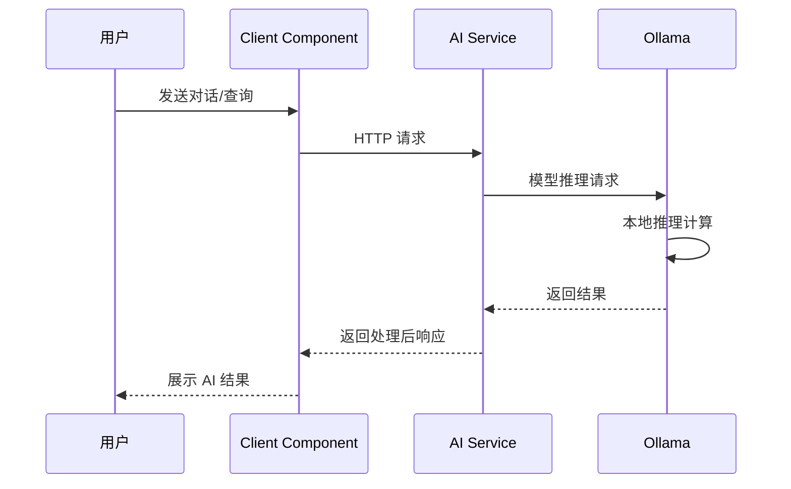
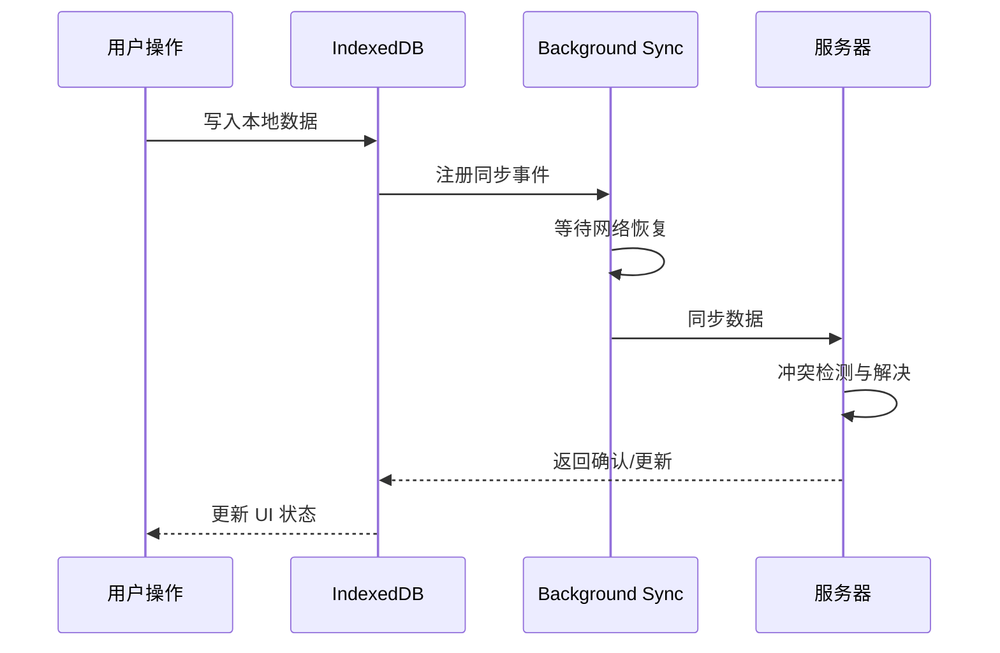

# 系统架构文档

## 整体架构

言语云企业管理系统采用现代化的前端架构，基于 **Next.js 16** 构建，集成了 AI 增强、离线支持、实时同步等先进功能。

## 技术栈

### 前端框架
| 技术 | 版本 | 用途 |
|------|------|------|
| **Next.js** | 16.2 | React 框架，App Router + RSC |
| **React** | 19.2 | UI 库，Server/Client Components |
| **TypeScript** | 5.9 | 类型安全与开发体验 |

### UI 组件
| 技术 | 版本 | 用途 |
|------|------|------|
| **Radix UI** | latest | 无障碍组件库 |
| **Tailwind CSS** | 3.4 | 实用优先的 CSS 框架 |
| **Lucide React** | 0.494 | 图标库 |
| **Recharts** | 2.15 | 数据可视化图表 |
| **shadcn/ui** | latest | 组件组合层 |

### AI 集成
| 技术 | 用途 |
|------|------|
| **Ollama** | 本地大语言模型服务 |
| **AI Enhancement Service** | 自研 AI 增强服务 |
| **自然语言处理** | NLP 能力集成 |

### 数据管理
| 技术 | 用途 |
|------|------|
| **IndexedDB** | 本地数据存储 |
| **Background Sync** | 后台同步 |
| **Conflict Resolution** | 冲突解决 |

### PWA 支持
| 技术 | 用途 |
|------|------|
| **Service Worker** | 离线缓存 |
| **Web Push** | 推送通知 |
| **App Manifest** | 应用清单 |

### 工程化
| 技术 | 版本 | 用途 |
|------|------|------|
| **Vitest** | 3.1 | 单元测试 |
| **ESLint** | 9.25 | 代码规范 |
| **pnpm** | 11.10 | 包管理 |
| **PostCSS** | 8.5 | CSS 处理 |

---

## 架构总览



---

## 核心模块

### 1. 应用入口 (app/layout.tsx)
- Next.js 16 App Router 根布局
- PWA 元数据配置
- 响应式布局提供者
- 全局样式（Tailwind + CSS 变量）
- 加载状态管理

### 2. AI 增强系统
| 组件 | 描述 |
|------|------|
| **AI Enhancement Service** | 核心 AI 服务，对话与推荐引擎 |
| **Ollama Integration** | 本地 LLM 集成（Qwen2.5） |
| **Smart Recommendations** | 基于业务数据的智能推荐 |
| **Predictive Analytics** | 销售、客户趋势预测分析 |
| **Anomaly Detection** | 业务数据异常自动检测 |
| **Automation Engine** | 智能自动化工作流引擎 |

### 3. 数据管理
| 组件 | 描述 |
|------|------|
| **Local Database** | IndexedDB 封装，离线数据存储 |
| **Background Sync** | 后台同步服务，网络恢复后自动同步 |
| **Conflict Resolution** | 冲突解决策略（最后写入/时间戳/手动） |
| **Offline Storage** | 离线存储管理与队列机制 |

### 4. 业务模块
| 模块 | 核心功能 |
|------|----------|
| **Dashboard** | 实时数据概览、KPI 指标、快速操作 |
| **Task Management** | 生命周期管理、优先级、依赖关系、时间跟踪 |
| **Customer Management** | CRM 全流程、生命周期、满意度分析 |
| **Finance** | 收支管理、发票、报表、税务计算 |
| **OKR** | 目标与关键结果对齐、进度追踪 |
| **Approval** | 灵活的审批工作流配置 |
| **Communication** | 团队协作与沟通工具 |
| **KPI** | 绩效指标跟踪与多维度评估 |
| **Analytics** | 销售、客户、产品、地区多维分析 |

### 5. 移动端支持
| 特性 | 实现 |
|------|------|
| **Mobile Layout** | 响应式布局，自动适配屏幕尺寸 |
| **Touch Gestures** | 触摸手势支持（滑动、缩放、长按） |
| **Mobile Notifications** | 移动端通知中心 |
| **Responsive Design** | 移动端安全区域适配（safe-area-inset） |
| **PWA** | 可安装为移动应用 |

### 6. PWA 功能
| 功能 | 描述 |
|------|------|
| **Service Worker** | 离线资源缓存与网络代理 |
| **Push Notifications** | Web Push 推送通知 |
| **Install Prompt** | 应用安装提示 |
| **Offline Support** | 离线数据操作与自动同步 |

---

## 数据流

### 1. 用户交互流程
```
用户操作 → React Event → 业务逻辑处理 → 状态更新 → UI 重渲染
```

### 2. AI 处理流程


### 3. 数据同步流程


### 4. 离线处理流程
```
离线操作 → 本地存储 IndexedDB → 操作队列 → 网络恢复 → 自动批量同步 → 冲突解决 → UI 更新
```

---

## 性能优化

### 1. 代码分割
- Next.js 16 自动路由级代码分割
- React.lazy + Suspense 组件懒加载
- 动态导入 dynamic import

### 2. 缓存策略
| 策略 | 实现 |
|------|------|
| Service Worker 缓存 | 离线资源缓存策略 |
| 浏览器缓存 | HTTP 缓存头控制 |
| 内存缓存 | React useMemo / useCallback |
| 本地存储 | IndexedDB 数据持久化 |

### 3. 渲染优化
- React.memo 组件记忆化
- useMemo / useCallback 值缓存
- 虚拟滚动（react-window）长列表优化
- 图片懒加载与优化

### 4. 资源优化
- 图片 WebP/AVIF 格式自动转换
- 字体子集化与优化
- CSS 压缩与 Tree Shaking
- Bundle 分析与优化

---

## 安全措施

### 1. 数据安全
| 措施 | 实现 |
|------|------|
| 本地数据加密 | IndexedDB 敏感字段加密 |
| HTTPS 传输 | 强制 HTTPS |
| XSS 防护 | React 默认转义 + CSP 头 |
| CSRF 防护 | SameSite Cookie + Token 验证 |

### 2. 访问控制
- 基于角色的权限管理（RBAC）
- 操作日志审计
- 会话管理与超时控制

### 3. AI 安全
- 本地模型运行，数据不出域
- 输入验证与净化
- 敏感信息过滤

---

## 扩展性

### 1. 模块化设计
- 独立业务模块，低耦合高内聚
- 可插拔组件架构
- 统一接口规范

### 2. 配置化
| 配置项 | 方式 |
|--------|------|
| 环境变量 | .env.local 配置文件 |
| 功能开关 | 配置中心动态开关 |
| 主题定制 | CSS 变量 + Tailwind 配置 |

### 3. 集成能力
- 第三方 API 集成接口
- Webhook 事件回调
- 插件化扩展架构

---

## 监控与日志

### 1. 性能监控
| 指标 | 采集方式 |
|------|----------|
| 页面加载时间 | Navigation Timing API |
| API 响应时间 | Performance Observer |
| 资源使用 | Performance Observer |
| 核心 Web 指标 | Lighthouse CI 自动化审计 |

### 2. 错误追踪
- 全局错误捕获与上报
- React Error Boundary 组件级错误处理
- 网络请求异常重试机制

### 3. 日志系统
- 操作日志记录
- 审计日志追踪
- 性能日志分析

---

## 测试策略

### 单元测试
- **Vitest 3**: 测试运行器
- **Testing Library**: React 组件测试
- **覆盖率目标**: 全局 80%+ （branches/functions/lines/statements）

### 测试类型
| 类型 | 工具 | 覆盖范围 |
|------|------|----------|
| 单元测试 | Vitest + Testing Library | 组件、Hooks、工具函数 |
| 组件测试 | Vitest + jsdom/happy-dom | UI 组件交互 |
| 快照测试 | Vitest snapshots | UI 输出验证 |
| 覆盖率 | @vitest/coverage-v8 | 代码覆盖分析 |

---

## 更新记录

| 版本 | 日期 | 变更内容 |
|------|------|----------|
| 2.0.0 | 2026-07 | 升级 Next.js 16 + React 19 核心框架 |
| 1.0.0 | - | 初始版本 |
